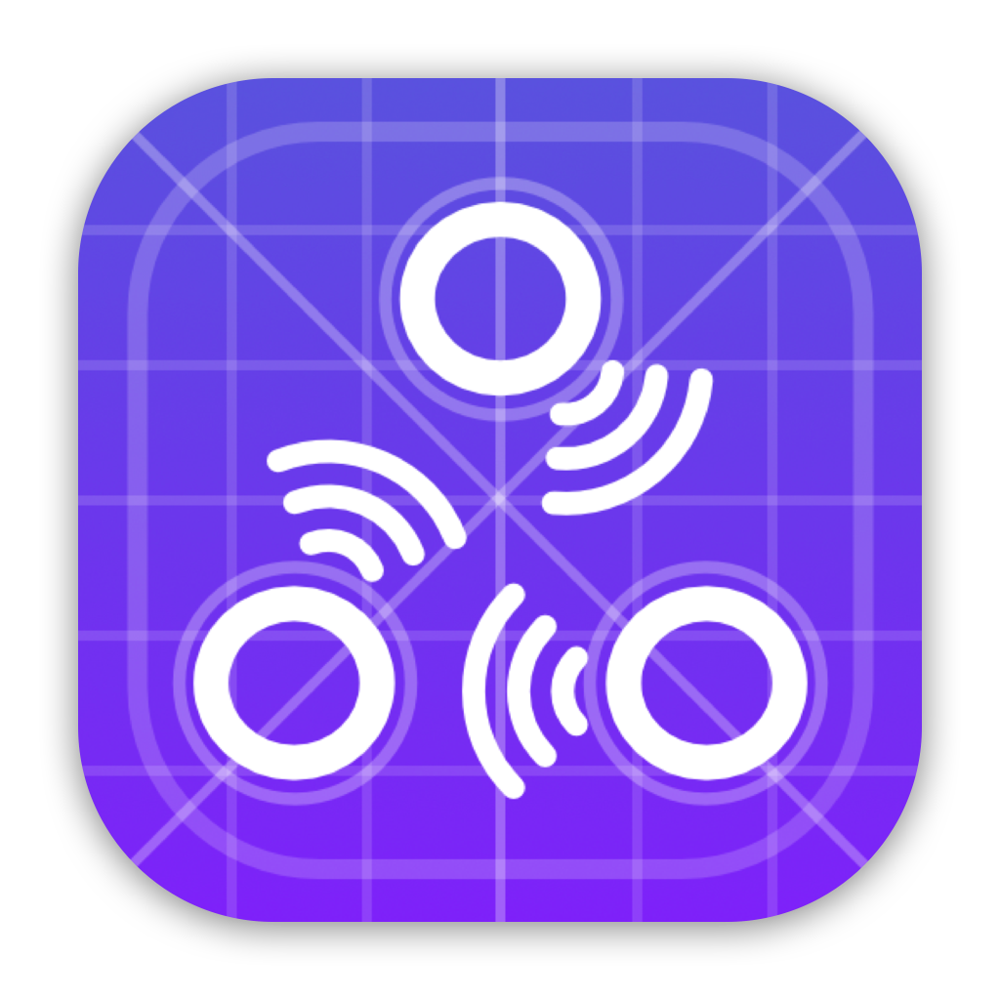

    

  <h1 align="center">InterShare SDK</h1>

This is the internal SDK used by the InterShare clients.

## Encryption

The network stream is encrypted using the `XChaCha20` algorithm ([using this crate](https://crates.io/crates/chacha20)).
